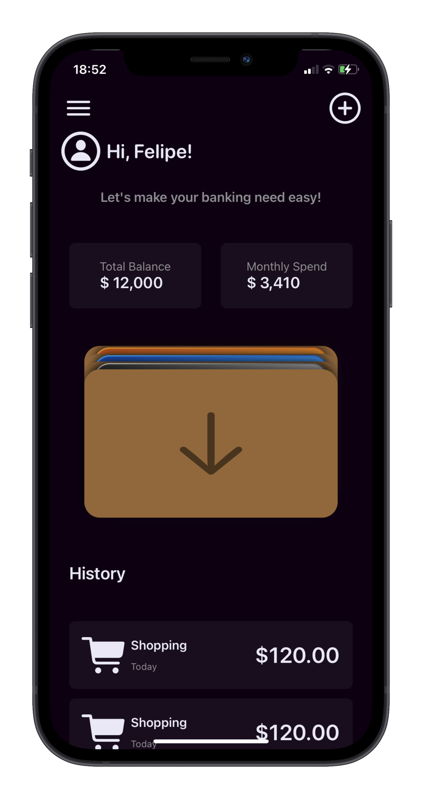
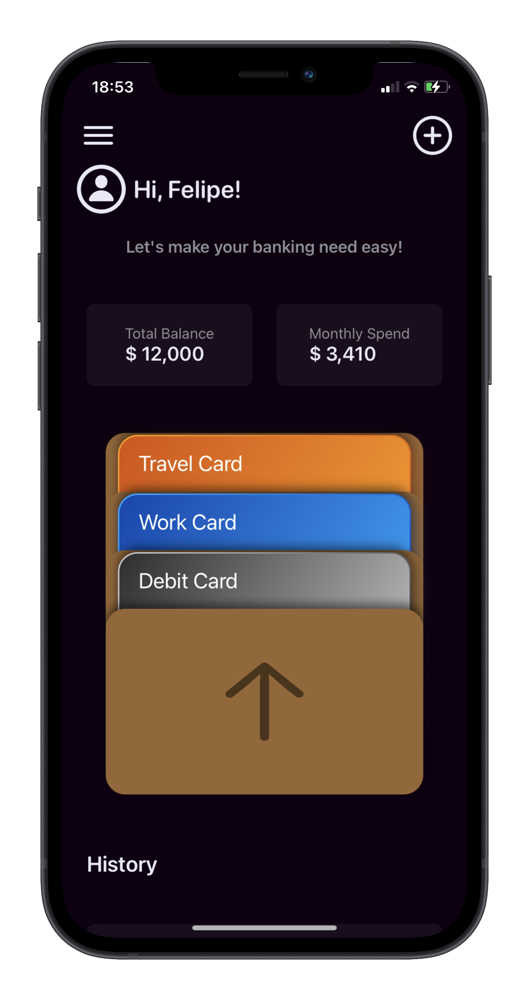
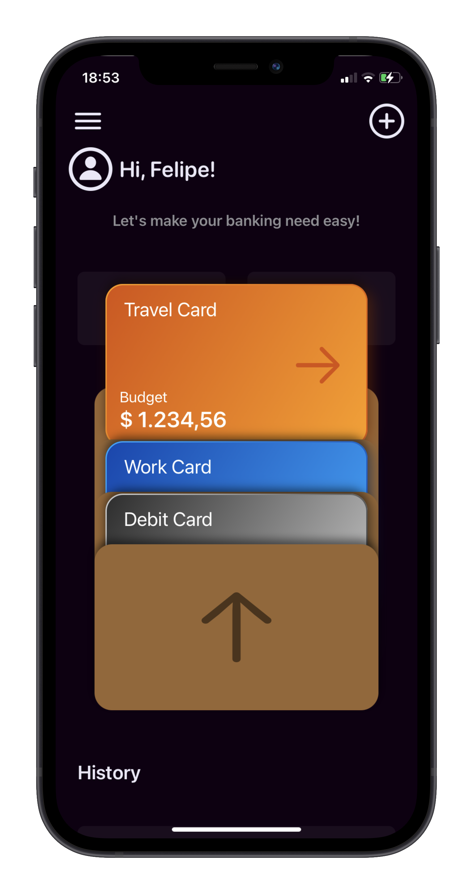
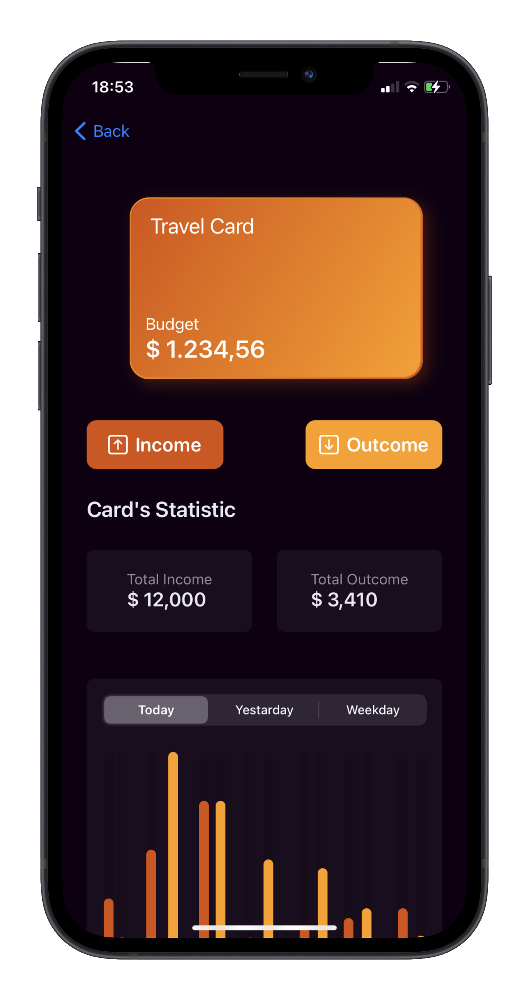
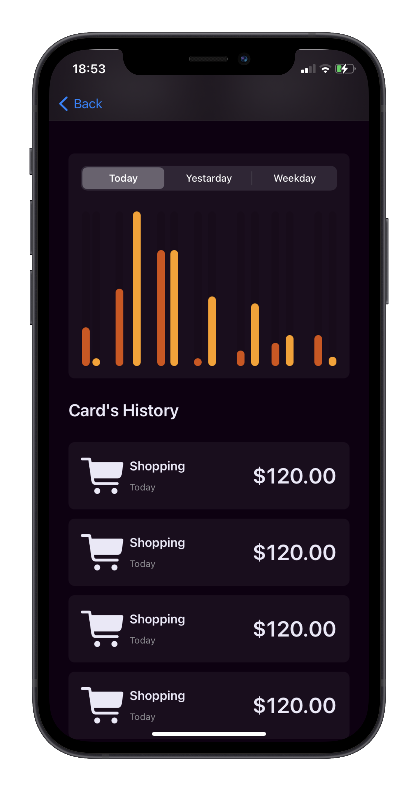
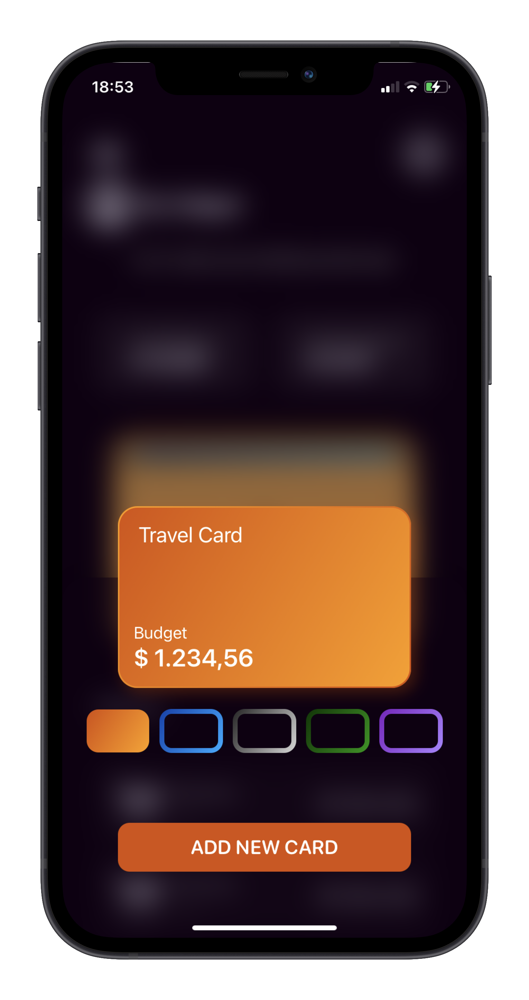
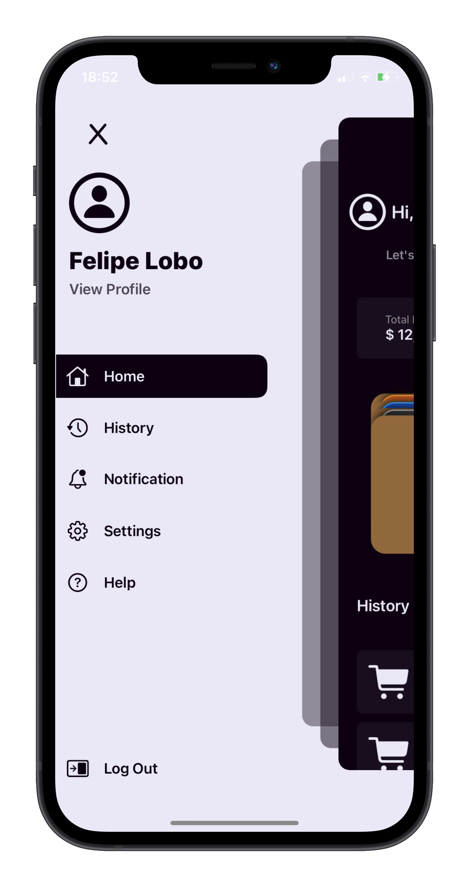

  
  <h1 align="center">Carteira</h1>
  <h3 align="center">A simple and minimalist finance app with really cool looking wallet on it!.</h3>
  

    
    
    
    
    
    
    
  

  
You see? It already cought your attention didn't?

